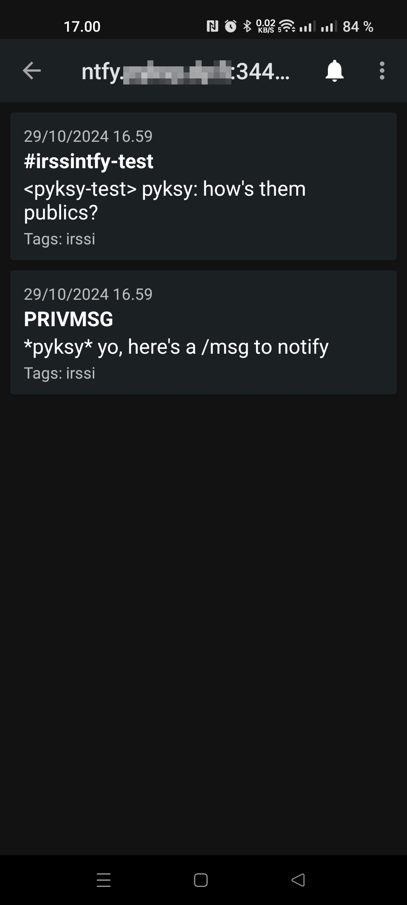

# IrssiNtfy
Irssi script to send notifications from Irssi via ntfy; see https://ntfy.sh/

This hack job is based on IrssiNotifier; see https://github.com/murgo/IrssiNotifier

# Setup
1. Host or rent an ntfy instance; see https://ntfy.sh/ for releases or service options
2. Install ntfy app to your phone; again see https://ntfy.sh/ for appstore links
3. Add subscription to your phone app: enter topic name, for example irssi, and enter your ntfy server url
4. Copy irssintfy.pl to ~/.irssi/scripts/autorun/ and load in Irssi: /script load autorun/irssintfy
5. In irssi, configure ntfy notification url (with topic name as the path): /set irssintfy_api_url https://<your_ntfy_server_address>/irssi
6. If authentication is needed to send notifications, create an authentication token for your ntfy user and configure it to irssi: /set irssintfy_auth_token tk_xxxxxxxxxxxxxxxxxxxxxxxxxxxxx
7. Configure other settings starting with irssintfy_ to your taste and remember to /save

# Disclaimer
This is a hack job. Use at your own risk.

# Screenshot

